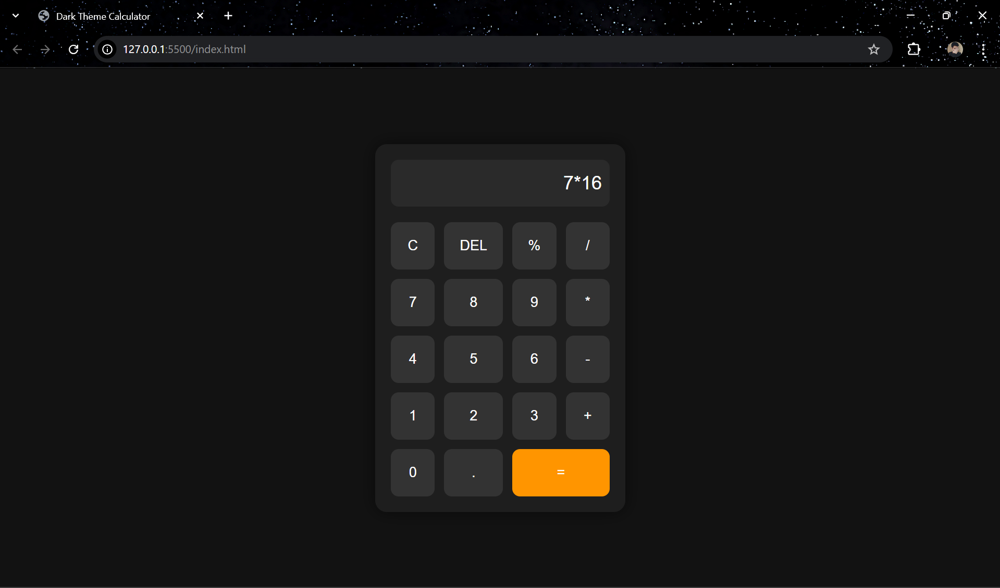

# 🧮 Interactive Calculator  

An **interactive and responsive calculator** built using **HTML, CSS, and JavaScript**.  
✨ It supports basic arithmetic operations, clear and backspace functions, and comes with a **clean, modern UI** that works seamlessly across devices.  

---

## 🚀 Features  

- ➕➖✖️➗ Perform basic arithmetic operations  
- 🔄 **Clear** & 🔙 **Backspace** functionality  
- 🎨 Stylish & modern **responsive UI**  
- ⚡ Super fast & lightweight  
- 📱 Works smoothly on **desktop & mobile**  

---

## 📸 Screenshots  

### 🏠 Calculator UI & Performing Operations 
  

---

## 📂 Project Structure  
<pre>📦 codsoft_task3_calculator/
├── 📄 index.html # 🏗️ Main calculator UI (HTML structure)
├── 🎨 style.css # 💅 Styling & responsive design (CSS)
├── ⚡ script.js # 🧠 Logic & interactivity (JavaScript)
├── 📝 README.md # 📖 Documentation file
└── 📸 screenshots/ # 🖼️ Project screenshots
├── calculator.png
├── operation.png
└── clear.png </pre>


---
<br>

## 🚀 Live Demo  

👉 [Click here to open the Calculator Project](https://rohnak07.github.io/codsoft_task3_calculator/)  


<br>

---

## 🖥️ How to Run  

1. 📥 Clone the repository  
   ```bash
   git clone https://github.com/Rohnak07/codsoft_task3_calculator.git


2. 📂 Navigate to the project folder
   <br>
   cd codsoft_task3_calculator
3. 🌐 Open index.html in your browser
   <br>
    <br>
     <br>


  ## 📬 Contact Me  

💡 If you want to collaborate, share feedback, or just say hi — feel free to connect with me!  

- 📧 **Email:** [rohnakkumarsingh752004@gmail.com](mailto:rohnakkumarsingh752004@gmail.com)  
- 💼 **LinkedIn:** [linkedin.com/in/rohnaksingh](https://www.linkedin.com/in/rohnaksingh)  
- 🌍 **Portfolio:** [rohnak07.github.io/codsoft_task1_portfolio](https://rohnak07.github.io/codsoft_task1_portfolio/)  
- 🐙 **GitHub:** [github.com/Rohnak07](https://github.com/Rohnak07)  
- 📄 **CV/Resume:** [View My CV](https://drive.google.com/file/d/1UC9H4ic3ZsaOeTGE2-FmFe6_kDoAVVtI/view?usp=drivesdk)  
---

🔥 Let’s build something amazing together! 🚀  
⭐ If you found this project helpful, don’t forget to **star 🌟 the repo** and support me!

  
 
   
